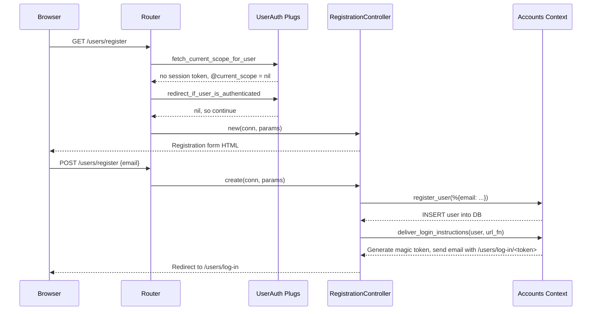
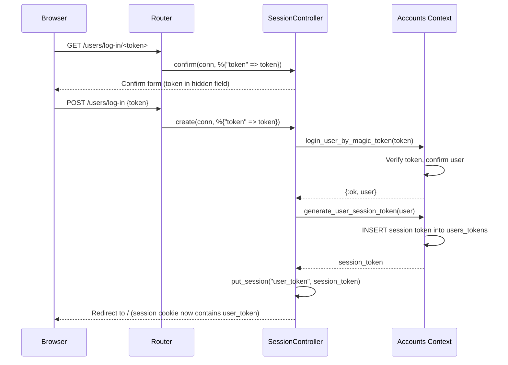
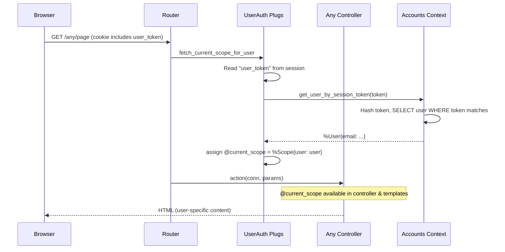
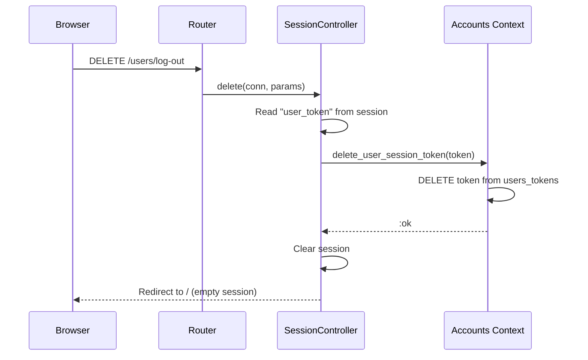

# Authentication Flow

## Registration & Login (Magic Link)

```mermaid
sequenceDiagram
    participant B as Browser
    participant R as Router
    participant P as UserAuth Plugs
    participant C as RegistrationController
    participant A as Accounts Context

    B->>R: GET /users/register
    R->>P: fetch_current_scope_for_user
    P-->>R: no session token, @current_scope = nil
    R->>P: redirect_if_user_is_authenticated
    P-->>R: nil, so continue

    R->>C: new(conn, params)
    C-->>B: Registration form HTML

    B->>R: POST /users/register {email}
    R->>C: create(conn, params)
    C->>A: register_user(%{email: ...})
    A-->>C: INSERT user into DB
    C->>A: deliver_login_instructions(user, url_fn)
    A-->>C: Generate magic token, send email with /users/log-in/<token>
    C-->>B: Redirect to /users/log-in
```

## Clicking the Magic Link

```mermaid
sequenceDiagram
    participant B as Browser
    participant R as Router
    participant C as SessionController
    participant A as Accounts Context

    B->>R: GET /users/log-in/<token>
    R->>C: confirm(conn, %{"token" => token})
    C-->>B: Confirm form (token in hidden field)

    B->>R: POST /users/log-in {token}
    R->>C: create(conn, %{"token" => token})
    C->>A: login_user_by_magic_token(token)
    A->>A: Verify token, confirm user
    A-->>C: {:ok, user}
    C->>A: generate_user_session_token(user)
    A->>A: INSERT session token into users_tokens
    A-->>C: session_token
    C->>C: put_session("user_token", session_token)
    C-->>B: Redirect to / (session cookie now contains user_token)
```

## Every Subsequent Request (Authenticated)

```mermaid
sequenceDiagram
    participant B as Browser
    participant R as Router
    participant P as UserAuth Plugs
    participant C as Any Controller
    participant A as Accounts Context

    B->>R: GET /any/page (cookie includes user_token)
    R->>P: fetch_current_scope_for_user
    P->>P: Read "user_token" from session
    P->>A: get_user_by_session_token(token)
    A->>A: Hash token, SELECT user WHERE token matches
    A-->>P: %User{email: ...}
    P->>P: assign @current_scope = %Scope{user: user}
    R->>C: action(conn, params)
    Note over C: @current_scope available in controller & templates
    C-->>B: HTML (user-specific content)
```

## Logout

```mermaid
sequenceDiagram
    participant B as Browser
    participant R as Router
    participant C as SessionController
    participant A as Accounts Context

    B->>R: DELETE /users/log-out
    R->>C: delete(conn, params)
    C->>C: Read "user_token" from session
    C->>A: delete_user_session_token(token)
    A->>A: DELETE token from users_tokens
    A-->>C: :ok
    C->>C: Clear session
    C-->>B: Redirect to / (empty session)
```
