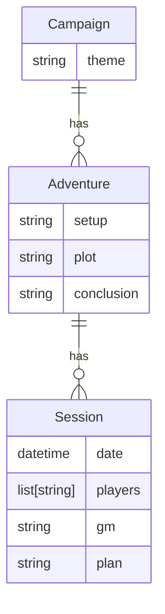

# Campaign Structure

```mermaid
erDiagram
  Campaign {
    string theme
  }
  Adventure {
    string setup
    string plot
    string conclusion
  }
  Session {
    datetime date
    list[string] players
    string gm
    string plan
  }

  Campaign ||--o{ Adventure : has
  Adventure ||--o{ Session : has
```
