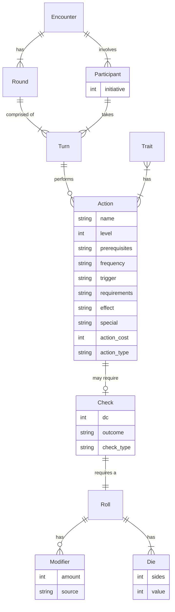

jk# Encounter

```mermaid
erDiagram
  Encounter {}
  Round {}
  Turn {}
  Action {
    string name
    int level
    string prerequisites
    string frequency
    string trigger
    string requirements
    string effect
    string special
    int action_cost
    string action_type
  }
  Trait {}
  Participant {
    int initiative
  }
  Check {
    int dc
    string outcome
    string check_type
  }
  Roll {}
  Modifier {
    int amount
    string source
  }
  Die {
    int sides
    int value
  }

  Encounter ||--|{ Round : has
  Encounter ||--|{ Participant: involves
  Round ||--|{ Turn : "comprised of"
  Participant ||--|{ Turn : takes
  Turn ||--o{ Action : "performs"
  Action ||--o| Check: "may require"
    
  Trait }|--|{ Action: "has"
  Check ||--|| Roll : "requires a"
  Roll ||--o{ Modifier : "has"
  Roll ||--|{ Die : "has"
```
